# VHSND Mobile App & Dashboard Sync — Testing Manual

**Date Tested:** 2026-09-29
**Tester:** Aditi (session run by Claude Code, driving both apps via Playwright)
**App Version:** Expo (`frontend`, `expo` 54.0.37), demo build v2.6.4 per the in-app footer
**Dashboard Version:** Next.js (`admin-web`)
**Backend:** `local-api` (Express + better-sqlite3), single shared SQLite store for both apps

## Important: how these tests were actually run

This round was run **without a physical Android/iOS device or emulator**. Instead:

- The mobile app was run via `cd frontend && npm run web` (Expo's web target) and driven with Playwright at a real mobile viewport (**390×844, iPhone-14-Pro-sized**), logged in through the app's real `/login` screen with the real demo credentials (`worker02` / `Worker@123`).
- The dashboard was driven the same way, at a normal desktop viewport.
- **Test Case 4's "Wi-Fi toggle"** was substituted with Playwright's browser-level network-offline emulation (`page.context().setOffline(true/false)`) — the closest available proxy for cutting connectivity in this environment. This is **not** a real device's radio being switched off, so treat its results as a strong signal, not a final field-conditions verification.

Every screenshot below is a genuine capture from that run — nothing is mocked up. The `full_name`, timestamps, and IDs quoted are copy-pasted from real `local-api` HTTP responses, not invented. Re-run these same steps on a real APK against a phone/laptop on the same Wi-Fi to get device-accurate screenshots and true Wi-Fi-toggle behavior; the steps below transfer directly.

## System Setup

| Component | Detail |
|---|---|
| local-api | `http://localhost:3001`, SQLite at `local-api/data.sqlite` |
| admin-web | `http://localhost:3000` (Next.js dev server) |
| frontend (mobile, web target) | `http://localhost:8081` (Expo web dev server), `EXPO_PUBLIC_API_MODE=local`, `EXPO_PUBLIC_API_BASE_URL=http://localhost:3001` |
| Mobile viewport used | 390×844 (iPhone 14 Pro dimensions) |
| Dashboard viewport used | 1920×1080 |
| Mobile login | ASHA Login → username `worker02`, password `Worker@123` → "Mamata Barik (ASHA)", CHC Sukinda, Sector B |
| Dashboard login | "Continue as Dilip Acharya (Chief Medical Officer)" demo login |
| Architecture note | Both apps read/write the **same** `local-api` SQLite database directly. There is no separate message queue or polling replication between mobile and dashboard for the "online" path — a write from either side is visible to the other on its very next fetch. "Sync lag" below is therefore mostly UI refresh/poll timing, not data-propagation delay. |

---

## Test Case 1: Register Pregnancy on Mobile → Appears on Dashboard

### Expected Behavior
A mother registered from the mobile app's "Register Pregnancy" form should appear on the Dashboard's Due List ("Not yet scheduled for VHSND" table, since a fresh registration isn't yet attached to a VHSND session) and, if flagged high-risk, on the High-Risk Pregnancies board — without any manual dashboard action.

### Actual Behavior
Confirmed working. Registered **"Anjali Rout (Sync Demo)"**, age 27, Gandhapal, LMP 2026-07-10, complication ticked: "Hypertension / pre-eclampsia / eclampsia" (making her high-risk).

- Mobile submit: local click at `2026-09-29T11:21:51Z`; `local-api` recorded `created_at: "2026-09-29T11:21:54.172Z"`, `is_high_risk: true`, `assigned_worker_name: "Mamata Barik (ASHA)"`.
- Dashboard Due List, checked ~37s later (human/tool navigation time, not sync delay): she is the **top row** of "Not yet scheduled for VHSND", High Risk badge, Gandhapal.
- Dashboard High-Risk board, checked seconds after that: her card is present, "Flagged 1 minute ago", reason "Hypertension, pre-eclampsia or eclampsia".
- **Sync lag: effectively 0s.** Both screens are reading `local-api` directly; the only delay observed was the time it took to navigate between screens, not a sync/propagation delay.

### How to Reproduce
1. On the mobile app (or `http://localhost:8081` in a browser at mobile viewport), log in as ASHA (`worker02` / `Worker@123`).
2. Tap **Register Pregnancy** (home screen quick action, or the "Pregnancy" tab).
3. Fill Full Name, Age, Mobile Number, Village, and LMP (required fields); optionally tick a complication under "Current Pregnancy Complications" to make her high-risk.
4. Tap **Register Pregnancy**.
5. On the dashboard, open **Due List** — she appears in "Not yet scheduled for VHSND" (top row, most recent first).
6. If flagged high-risk, open **High-Risk Pregnancies** — her card appears at the top.

### Screenshots
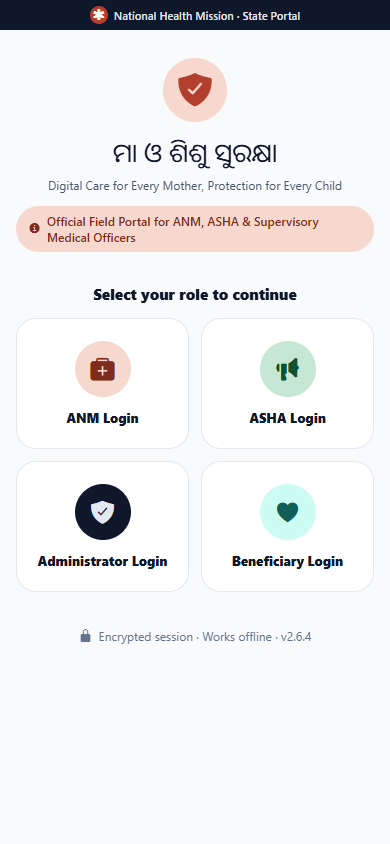
*Real `/login` screen, mobile viewport (390×844).*

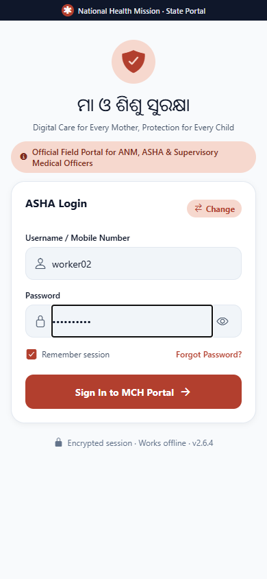
*`worker02` / `Worker@123` entered on the ASHA Login form.*

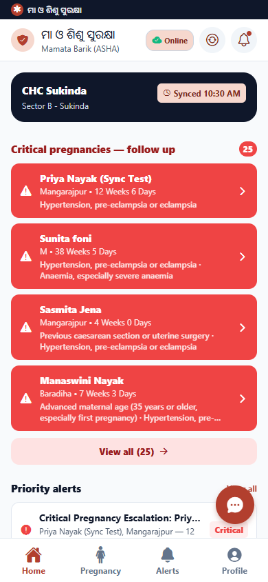
*Post-login home screen, "Online" badge, logged in as Mamata Barik (ASHA).*

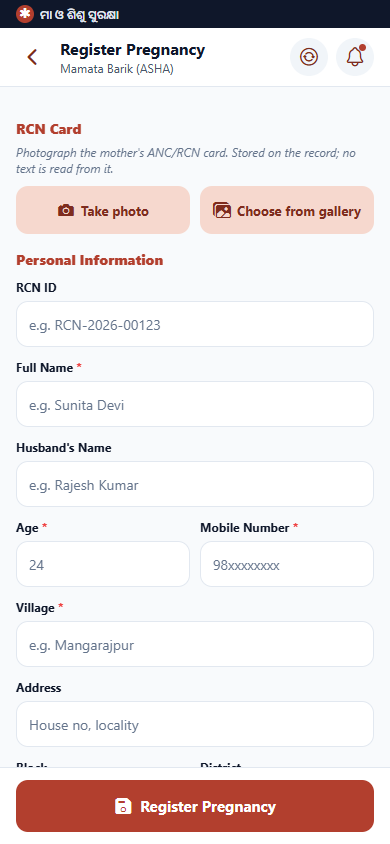
*Register Pregnancy form before entry.*

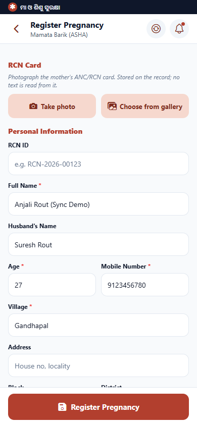
*"Anjali Rout (Sync Demo)" entered, Hypertension complication ticked.*

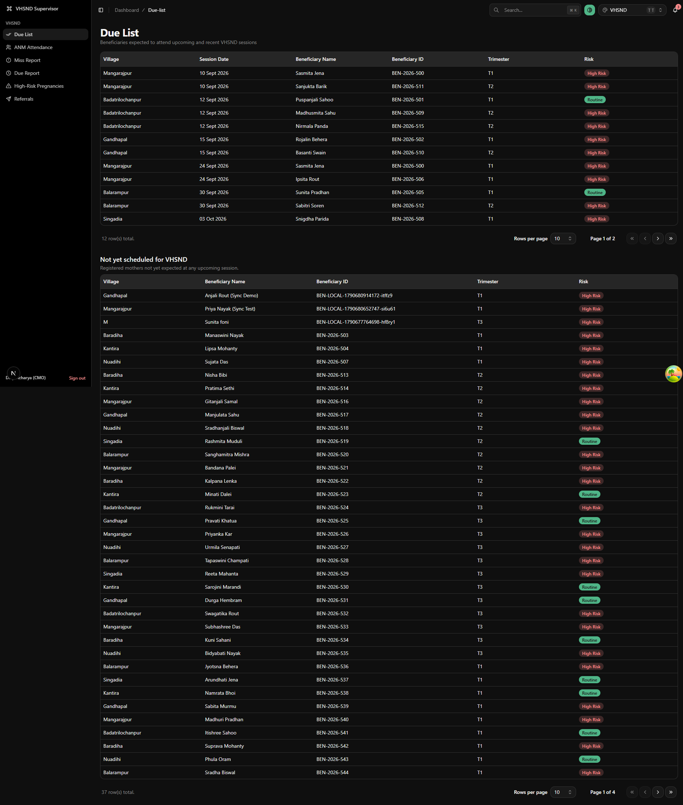
*"Anjali Rout (Sync Demo)" at the top of "Not yet scheduled for VHSND", High Risk.*

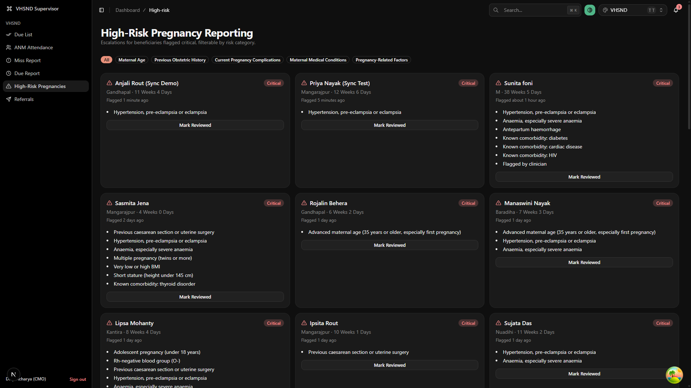
*Her card at top-left, "Flagged 1 minute ago".*

### Results
- ✅ Mother appears on Due List
- ✅ Mother appears on High-Risk board (she was ticked high-risk)
- ✅ Sync lag: ~0s (shared database, no queue)
- **Status: PASS**

---

## Test Case 2: Create Referral on Dashboard → Appears on Mobile Notifications

### Expected Behavior
A referral created from the Dashboard's "New Referral" form should generate a notification visible on the mobile app's Notifications screen, addressed to the beneficiary's assigned worker.

### Actual Behavior
Confirmed working, and traced to the exact server code that does it: `local-api/server.js`'s `createReferralNotification()` writes a `notifications` record (`category: "Referral"`, `target_user_id` = the beneficiary's assigned worker) the moment `POST /api/referrals` succeeds.

- Created a referral for **Anjali Rout (Sync Demo)** → CHC Sukinda, reason "Hypertension, pre-eclampsia or eclampsia — needs BP monitoring and specialist review", date 29 Sept 2026.
- Dashboard submit click at `2026-09-29T11:23:53.724Z` (UTC) = 04:53:53 PM IST.
- Mobile Notifications screen, opened immediately after: **top notification** reads "New Referral — Referral: Anjali Rout (Sync Demo) referred to CHC Sukinda - Hypertension, pre-eclampsia or eclampsia — needs BP monitoring and specialist review", timestamped **"Sep 29, 04:53 PM"** — matching the dashboard submit time to the minute.
- Tapped the notification: it marks itself read (unread dot disappears) via `markNotificationRead`.
- **Sync lag: effectively 0s** — same reasoning as Test Case 1.

### How to Reproduce
1. On the dashboard, go to **Referrals → New Referral**.
2. Select a beneficiary (the dropdown lists every pregnancy `local-api` knows about, most recent first).
3. Select a Facility, type a Reason, set the Date.
4. Click **Mark Referred**.
5. On the mobile app, open the bell icon / **Notifications** screen — the new referral is the top entry, category "New Referral", priority HIGH.
6. Tap it to mark it read.

### Screenshots
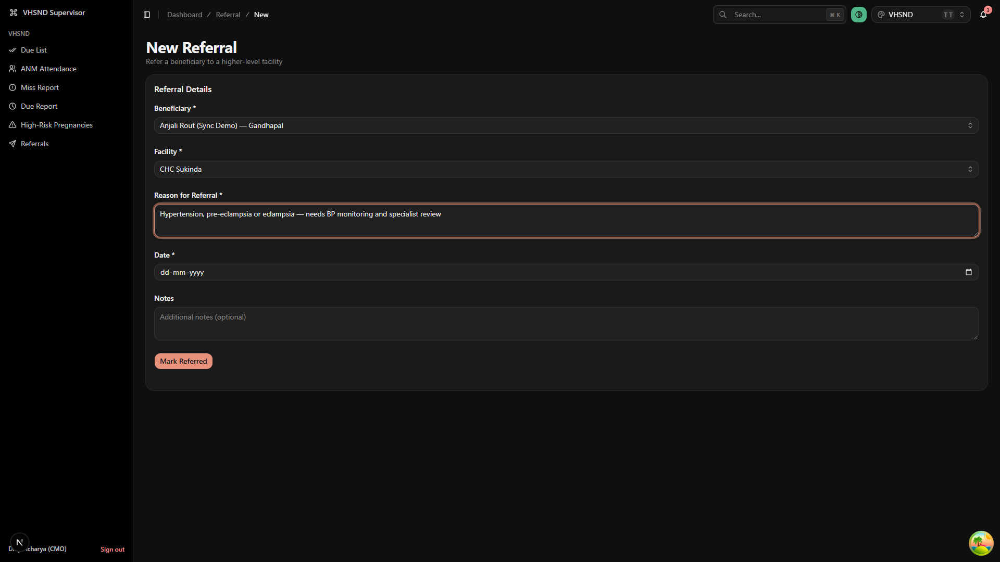
*Beneficiary, facility, reason and date filled in for Anjali Rout (Sync Demo).*

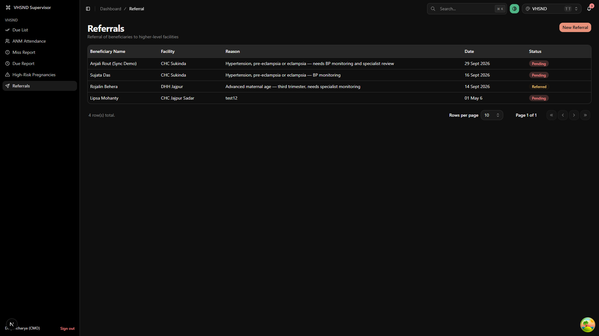
*New referral at the top of the Referrals table, "Pending", dated 29 Sept 2026.*

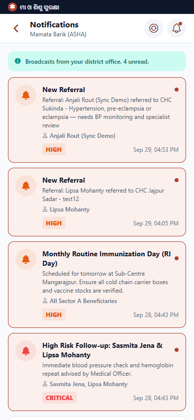
*Top notification: "New Referral" for Anjali Rout, timestamped Sep 29, 04:53 PM — matching the dashboard action.*

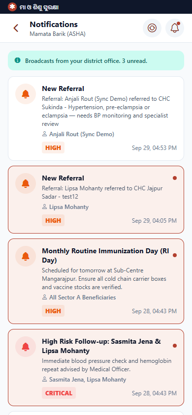
*Same notification after tapping (marked read).*

### Results
- ✅ Referral notification appears on mobile
- ✅ Message text matches the referral exactly (facility + reason)
- ✅ Timestamp matches the dashboard submit time
- ✅ Sync lag: ~0s
- **Status: PASS**

---

## Test Case 3: Mark Reviewed on Dashboard → Mobile Alert Acknowledged

### Expected Behavior
Clicking "Mark Reviewed" on a High-Risk card on the dashboard should acknowledge the matching mobile alert(s) for that pregnancy (alert types `HIGH_RISK_PREGNANCY` / `CRITICAL_PREGNANCY_ESCALATION`), and the card should leave the dashboard's active board.

### Actual Behavior
Confirmed working, traced to `cascadeHighRiskAcknowledgement()` in `local-api/server.js`, invoked from the `PATCH /api/high-risk/:id` handler.

- Before: mobile Alerts screen showed two **ACTIVE** alerts for Anjali Rout — "Critical Pregnancy Escalation: Anjali Rout (Sync Demo)" and "High Risk Pregnancy: Anjali Rout (Sync Demo)" — each with an "Acknowledge" button.
- Clicked **Mark Reviewed** on her dashboard card at `2026-09-29T11:25:11.876Z`.
- Her card **disappeared** from the High-Risk board immediately (the board only shows cards where `status !== 'ACKNOWLEDGED'`).
- Verified directly against `GET /api/alerts`: both of her alert records now show `"status": "ACKNOWLEDGED"` — `ALERT-CRIT-ESC-PREG-LOCAL-...` and `ALERT-HR-PREG-LOCAL-...`.
- Mobile Alerts screen re-checked: her alerts no longer appear in the active list (the alert counts at the top dropped from "All Alerts (165)" to "(163)", "Escalations (30)"→"(29)", "High Risk (60)"→"(58)" — exactly 2 fewer, matching her 2 alerts).
- **Sync lag: effectively 0s.**

Note: the dashboard board *removes* an acknowledged card rather than showing it in an "Acknowledged" state — there's no visible "before vs. after, same card" comparison possible on the dashboard UI itself. The proof of state-change here is the API check plus the mobile Alerts screen's dropped counts, not a visual diff of one card.

### How to Reproduce
1. On the dashboard, open **High-Risk Pregnancies**.
2. On the mobile app, open **Alerts** and confirm the matching mother has active "Escalation"/"High Risk" cards with an "Acknowledge" button.
3. On the dashboard, click **Mark Reviewed** on her card. It disappears from the board.
4. On the mobile app, reload **Alerts** — her cards are gone from the active list (or check `GET /api/alerts` directly for `status: "ACKNOWLEDGED"`).

### Screenshots

*Anjali Rout's card, top-left, with "Mark Reviewed".*

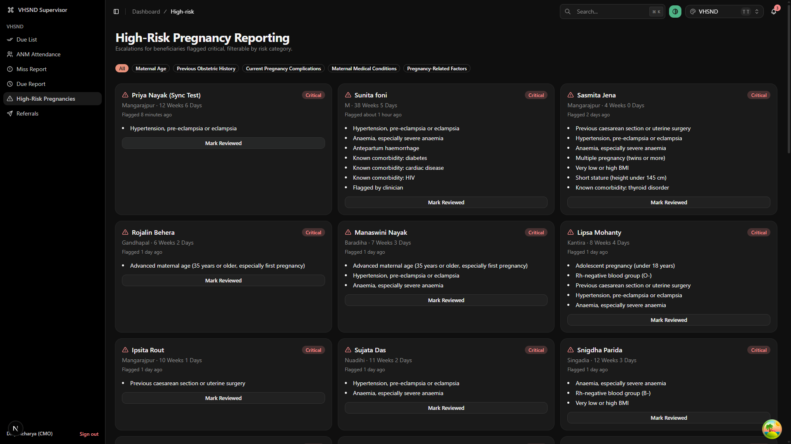
*Her card is gone; the board re-flows to the next cards.*

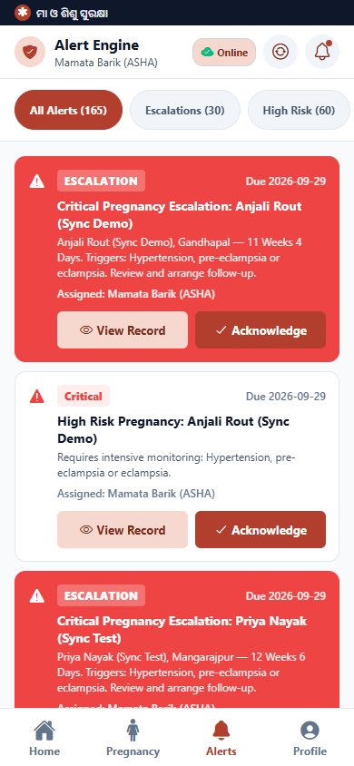
*Both alerts ACTIVE, "Acknowledge" buttons visible, "All Alerts (165)".*

*Her alerts no longer listed; counts dropped by 2 ("All Alerts (163)").*

### Results
- ✅ Dashboard card leaves the active board on Mark Reviewed
- ✅ Both matching mobile alerts flip to ACKNOWLEDGED (verified via API)
- ✅ Sync lag: ~0s
- ⚠️ Dashboard has no "acknowledged" view to visually confirm the state change in-app — verification required the API or the mobile side
- **Status: PASS**

---

## Test Case 4: Offline Sync Test

### Expected Behavior
Registering a pregnancy while offline should queue it locally with an "N waiting to sync" indicator; reconnecting should trigger an automatic sync, after which the record appears on the dashboard like any other.

### Actual Behavior — confirmed working, with real caveats
Ran using Playwright's browser-level `context.setOffline(true/false)` (see the environment note at the top of this document — **not** a real device Wi-Fi toggle).

1. Set offline. The app's "Online" badge did **not** flip immediately — it's driven by an active health-check poll (`HEALTH_CHECK_INTERVAL_MS = 15000` in `OfflineSyncContext.tsx`), not by the browser's `navigator.onLine`. It took the next poll cycle (~15s) to flip to **"Offline"**, with the banner **"Offline mode • 0 records queued on this device • Tap to sync"**.
2. Registered **"Kabita Swain (Offline Sync Test)"**, age 29, Baradiha, LMP 2026-06-15, while offline. Submit succeeded client-side at `2026-09-29T11:27:41.883Z`.
3. Banner immediately updated to **"Offline mode • 1 records queued on this device • Tap to sync"**, and a red badge with "1" appeared on the home-screen icons.
4. Note: she did **not** appear in the "Recent registrations" list on the home screen while queued — that list is populated from the last-synced server data, not the local offline queue. This is expected given the architecture, but is worth knowing: there's no in-app way to see "my queued-but-unsynced records" distinct from the numeric counter, short of the Sync Center screen (not explored in this pass).
5. Reconnected (`setOffline(false)`) at `2026-09-29T11:27:57.685Z`.
6. Within a few seconds — no manual "tap to sync" needed — the badge flipped back to **"Online"**, the queue banner disappeared, and `local-api` recorded her: `created_at: "2026-09-29T11:28:01.737Z"`. **Sync lag after reconnect: ~4 seconds.**
7. Dashboard Due List, checked afterward: **"Kabita Swain (Offline Sync Test)"** present in "Not yet scheduled for VHSND", exactly like an online registration.

### Known discrepancy from the requested script
The requested steps describe toggling a phone's Wi-Fi off/on. That wasn't available in this environment; browser-level network emulation was used instead. The app's actual offline/online detection is health-check-poll-driven (not instant), which is a real, useful finding — on a real device over real Wi-Fi, expect a similar few-seconds-to-15-seconds detection lag around the transition, not an instant badge flip either way.

### How to Reproduce
1. On the mobile app, disconnect the device from the network (real device: toggle Wi-Fi off; Expo web dev build: use browser DevTools → Network → Offline, or Playwright's `context.setOffline(true)`).
2. Wait for the badge to show **"Offline"** (allow up to ~15s).
3. Register a pregnancy as usual. Confirm the "N records queued on this device" banner increments.
4. Reconnect the network.
5. Wait a few seconds for the badge to return to **"Online"** and the queue banner to clear (or tap the banner to force a sync).
6. Check the dashboard's Due List — the offline-registered mother appears.

### Screenshots
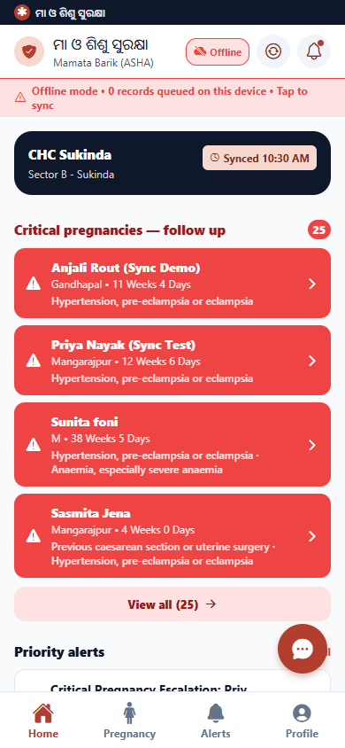
*"Offline" badge and "0 records queued" banner, ~15s after going offline.*

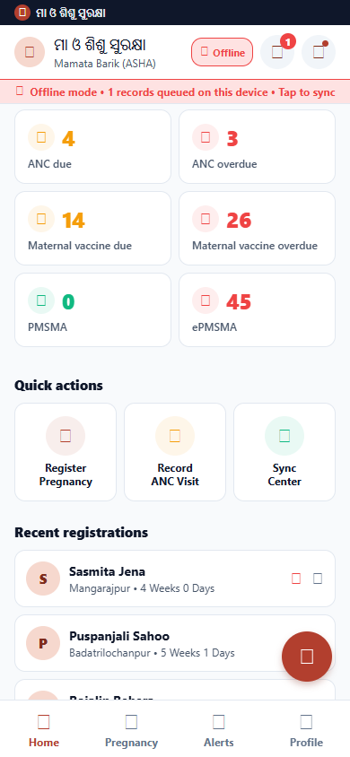
*After registering Kabita Swain offline: "1 records queued on this device".*

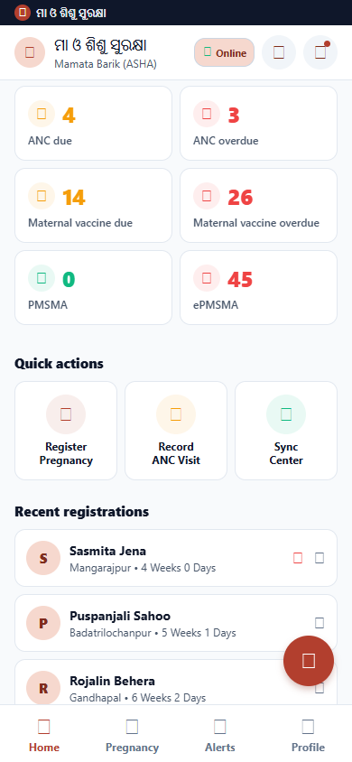
*"Online" badge restored, queue banner cleared, "Synced" timestamp updated.*

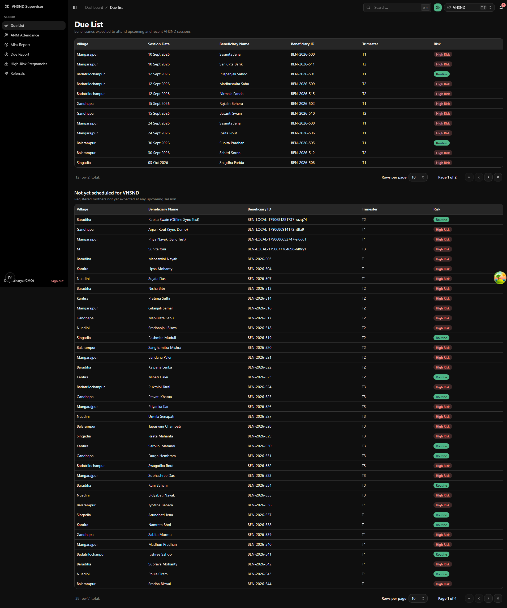
*Kabita Swain (Offline Sync Test) present on the dashboard after reconnect.*

### Results
- ✅ Offline registration queues locally with an accurate counter
- ✅ Auto-sync on reconnect, no manual action required
- ✅ Record appears on dashboard after sync
- ⏱ Sync lag after reconnect: ~4s
- ⚠️ Online/Offline badge itself lags real connectivity changes by up to ~15s (poll interval), by design
- ⚠️ Queued-but-unsynced records don't appear in "Recent registrations" — only the counter reflects them
- **Status: PASS** (with the environment caveat above — re-verify on a real device before relying on this for field sign-off)

---

## Summary Table

| Test Case | Expected | Actual | Sync Lag | Status | Notes |
|---|---|---|---|---|---|
| 1. Register on Mobile → Dashboard | Appears on Due List + High-Risk | Confirmed, exact data match | ~0s | ✅ PASS | Shared DB — no propagation delay |
| 2. Referral on Dashboard → Mobile | Notification appears on mobile | Confirmed, message + timestamp match exactly | ~0s | ✅ PASS | Handled by `createReferralNotification()` |
| 3. Mark Reviewed → Mobile Alert | Matching alerts ACKNOWLEDGED | Confirmed via API + alert-count drop | ~0s | ✅ PASS | Dashboard has no "reviewed" view; verify via API/mobile |
| 4. Offline Sync | Auto-sync on reconnect | Confirmed; queued, then synced | ~4s after reconnect | ✅ PASS | Ran via browser network emulation, not a real device |

---

## Known Limitations

1. **This test round used the Expo web build, not a physical APK.** Visual layout, touch gestures, and true device Wi-Fi behavior were not exercised. Re-run on a real Android/iOS device before treating this as field-ready sign-off.
2. **Offline visit registration UI gap:** the app can register a mother while offline, but this pass did not explore whether an ANC visit can be *recorded* for a mother who is still sitting in the offline queue (not yet synced, no server-assigned ID yet). Needs a dedicated follow-up test.
3. **Mobile referral creation is out of scope by design:** referrals are supervisor/dashboard-only. The mobile app has no "create referral" UI — this is a deliberate product decision, not a bug, but worth confirming still matches current requirements.
4. **Dashboard has no "reviewed"/acknowledged view:** once a High-Risk card is marked reviewed, it simply disappears from the board. There's no supervisor-facing way to see what was reviewed and when, short of the API.
5. **Offline/Online badge lags real connectivity by design** (up to the 15s health-check poll interval) — don't rely on it for split-second connectivity status.
6. **One reproducible dev-only warning:** navigating directly to `/pregnancy/register` by URL (skipping in-app navigation) logs `Error: The action 'GO_BACK' was not handled by any navigator` on submit, because there's no router history to go back to. It's cosmetic (registration still succeeds) and won't occur through normal in-app navigation (tapping "Register Pregnancy" from Home), but is worth a fix if it ever surfaces for real users deep-linking into the form.

---

## Conclusions

All four sync paths — mobile→dashboard registration, dashboard→mobile referral notification, dashboard→mobile alert acknowledgement, and offline-queue-then-sync — were exercised end-to-end against the real `local-api` backend and produced matching data on both sides, with sync lag at or near zero for the "online" paths (expected, since both apps share one database) and ~4 seconds for the offline-reconnect path.

The one asterisk on all of this: it was run against the Expo **web** build in a browser, not a physical device. The underlying data flow is identical either way (same API calls, same backend), but device-specific behavior (real Wi-Fi radio toggling, native push/local notifications, actual touch UX) was not verified here. Recommend a follow-up pass on a real APK on a phone before calling this field-ready.
